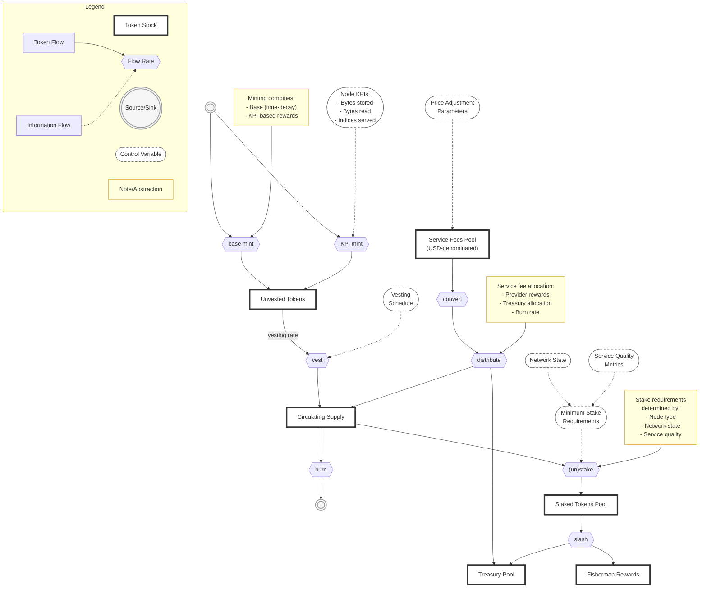

```mermaid
flowchart TB
    %% Define styles
    classDef stock fill:#fff,stroke:#333,stroke-width:4px
    classDef cloud fill:#f5f5f5,stroke:#999,stroke-width:2px
    classDef valve fill:#fff,stroke:#333,stroke-width:2px
    classDef control fill:#fff,stroke:#666,stroke-width:1px,stroke-dasharray: 5 5
    classDef note fill:#ffd,stroke:#da3,stroke-width:1px

    %% Legend
    subgraph Legend["Legend"]
        L_Stock["Token Stock"]:::stock
        L_Source((("Source/Sink"))):::cloud
        L_Flow{{"Flow Rate"}}
        L_Control(["Control Variable"]):::control
        L_Note["Note/Abstraction"]:::note
        L_TokenFlow["Token Flow"] --> L_Flow
        L_InfoFlow["Information Flow"] -.-> L_Flow
    end

    %% Sources and Sinks
    InitialSupply(((" "))):::cloud
    BurnSink(((" "))):::cloud

    %% Stocks (represented as rectangles with thicker borders)
    Treasury["Treasury Pool"]:::stock
    StakedTokens["Staked Tokens Pool"]:::stock
    ServiceFees["Service Fees Pool<br/>(USD-denominated)"]:::stock
    CirculatingSupply["Circulating Supply"]:::stock
    UnvestedTokens["Unvested Tokens"]:::stock
    FishermanRewards["Fisherman Rewards"]:::stock

    %% Control Variables (ovals with dashed borders)
    NetworkState(["Network State"]):::control
    MinStake(["Minimum Stake<br/>Requirements"]):::control
    ServiceQuality(["Service Quality<br/>Metrics"]):::control
    PriceParams(["Price Adjustment<br/>Parameters"]):::control
    VestingSchedule(["Vesting<br/>Schedule"]):::control
    KPIs(["Node KPIs:<br/>- Bytes stored<br/>- Bytes read<br/>- Indices served"]):::control

    %% Flows (represented as diamonds)
    BaseMint{{"base mint"}}
    KPIMint{{"KPI mint"}}
    Vest{{"vest"}}
    StakeUnstake{{"(un)stake"}}
    Distribute{{"distribute"}}
    Burn{{"burn"}}
    Slash{{"slash"}}
    Convert{{"convert"}}

    %% Notes
    ServiceAllocation["Service fee allocation:<br/>- Provider rewards<br/>- Treasury allocation<br/>- Burn rate"]:::note
    StakeNote["Stake requirements<br/>determined by:<br/>- Node type<br/>- Network state<br/>- Service quality"]:::note
    MintNote["Minting combines:<br/>- Base (time-decay)<br/>- KPI-based rewards"]:::note

    %% Connections
    InitialSupply --> BaseMint
    InitialSupply --> KPIMint
    KPIs -.-> KPIMint
    BaseMint --> UnvestedTokens
    KPIMint --> UnvestedTokens
    UnvestedTokens --> |"vesting rate"| Vest
    VestingSchedule -.-> Vest
    Vest --> CirculatingSupply

    CirculatingSupply --> StakeUnstake
    StakeUnstake --> StakedTokens
    MinStake -.-> StakeUnstake
    NetworkState -.-> MinStake
    ServiceQuality -.-> MinStake

    ServiceFees --> Convert
    Convert --> Distribute
    Distribute --> Treasury
    Distribute --> CirculatingSupply
    PriceParams -.-> ServiceFees

    StakedTokens --> Slash
    Slash --> Treasury
    Slash --> FishermanRewards

    CirculatingSupply --> Burn
    Burn --> BurnSink

    %% Positioning
    ServiceAllocation --> Distribute
    StakeNote --> StakeUnstake
    MintNote --> BaseMint
```
