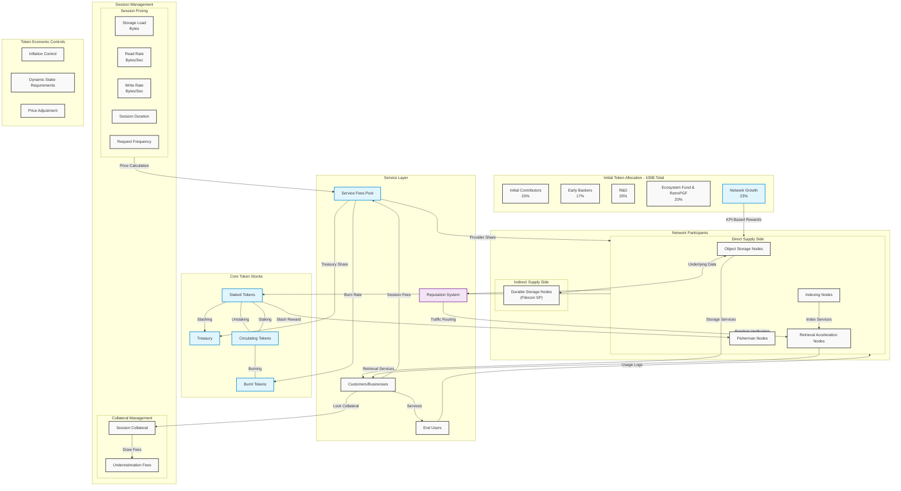

```mermaid
flowchart TB
%% Define styles
classDef default fill:#f9f9f9,stroke:#333,stroke-width:2px
classDef pool fill:#e1f5fe,stroke:#0288d1
classDef system fill:#f3e5f5,stroke:#7b1fa2

%% Initial Token Allocation (Static Stocks)
subgraph TokenAllocation["Initial Token Allocation - 100B Total"]
    direction LR
    InitialContributors["Initial Contributors<br/>20%"]
    EarlyBackers["Early Backers<br/>17%"]
    RAndD["R&D<br/>20%"]
    EcoSystem["Ecosystem Fund & RetroPGF<br/>20%"]
    NetworkGrowthPool["Network Growth<br/>23%"]:::pool
end

%% Core Token Stocks
subgraph CoreTokens["Core Token Stocks"]
    direction LR
    Treasury["Treasury"]:::pool
    StakedTokens["Staked Tokens"]:::pool
    CirculatingTokens["Circulating Tokens"]:::pool
    BurntTokens["Burnt Tokens"]:::pool
end

%% Supply Side Participants
subgraph SupplyParticipants["Network Participants"]
    subgraph DirectSupply["Direct Supply Side"]
        direction TB
        OSN["Object Storage Nodes"]
        RAN["Retrieval Acceleration Nodes"]
        IN["Indexing Nodes"]
        FN["Fisherman Nodes"]
    end

    subgraph IndirectSupply["Indirect Supply Side"]
        DSN["Durable Storage Nodes<br/>(Filecoin SP)"]
    end
end

%% Service Layer
subgraph ServiceLayer["Service Layer"]
    direction LR
    Customers["Customers/Businesses"]
    EndUsers["End Users"]
    ServiceFees["Service Fees Pool"]:::pool
    ReputationSystem["Reputation System"]:::system
end

%% Session Management
subgraph SessionManagement["Session Management"]
    direction TB
    subgraph SessionPricing["Session Pricing"]
        StorageLoad["Storage Load<br/>Bytes"]
        ReadRate["Read Rate<br/>Bytes/Sec"]
        WriteRate["Write Rate<br/>Bytes/Sec"]
        Duration["Session Duration"]
        Frequency["Request Frequency"]
    end

    subgraph CollateralSystem["Collateral Management"]
        SessionCollateral["Session Collateral"]
        UnderestimationFees["Underestimation Fees"]
    end
end

%% Token Economics Controls
subgraph TokenEconomics["Token Economic Controls"]
    direction LR
    InflationControl["Inflation Control"]
    StakeRequirements["Dynamic Stake Requirements"]
    PriceAdjustment["Price Adjustment"]
end

%% Flows and Connections
%% Network Growth Distribution
NetworkGrowthPool -->|"KPI-Based Rewards"| DirectSupply

%% Service Provider Interactions
OSN <-->|"Underlying Data"| DSN
OSN -->|"Storage Services"| Customers
RAN -->|"Retrieval Services"| Customers
IN -->|"Index Services"| RAN
FN -->|"Random Verification"| DirectSupply

%% Reputation and Performance
DirectSupply -->|"Performance Metrics"| ReputationSystem
ReputationSystem -->|"Traffic Routing"| RAN

%% Staking and Security
DirectSupply -->|"Required Stake"| StakedTokens
StakedTokens -->|"Slashing"| Treasury
StakedTokens -->|"Slash Reward"| FN

%% Payment Flows
Customers -->|"Session Fees"| ServiceFees
ServiceFees -->|"Treasury Share"| Treasury
ServiceFees -->|"Provider Share"| DirectSupply
ServiceFees -->|"Burn Rate"| BurntTokens

%% Session and Pricing
SessionPricing -->|"Price Calculation"| ServiceFees
Customers -->|"Lock Collateral"| SessionCollateral
SessionCollateral -->|"Draw Fees"| UnderestimationFees

%% User Journey
Customers -->|"Services"| EndUsers
EndUsers -->|"Usage Logs"| DirectSupply

%% Token State Changes
CirculatingTokens ---|"Staking"| StakedTokens
StakedTokens ---|"Unstaking"| CirculatingTokens
CirculatingTokens ---|"Burning"| BurntTokens
```
